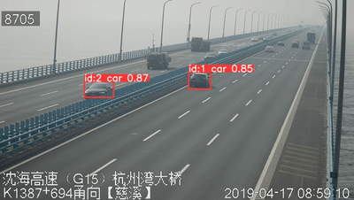

# Traffic-Flow-Analysis-System

<p align="center">
  <a href="./README_en.md">English</a> |
  <a href="./README.md">简体中文</a>
</p>


This project is a traffic flow analysis system built using the YOLOv8 model.



## Features

- **Vehicle Recognition**: Capable of recognizing various vehicle types including sedans, trucks, buses, etc.
- **Traffic Volume Statistics**: Can separately count the traffic volume in both directions.
- **License Plate Recognition**: Able to recognize license plates in clear videos.
- **More Features**: Still in development.

## Installation

To run this project, you need to install Python 3.8 or higher. First, clone this repository:

```bash
git clone https://github.com/LinYujupiter/Traffic-Flow-Analysis-System.git
cd Traffic-Flow-Analysis-System
```

## Environment Setup

### Using Conda

If you're using Conda, you can set up and activate a virtual environment as follows:

1. **Create a virtual environment**:

   ```bash
   conda create -n Traffic-Flow-Analysis-System python=3.8
   ```

2. **Activate the virtual environment**:

   ```bash
   conda activate Traffic-Flow-Analysis-System
   ```

3. **Install dependencies**:

   Within the activated virtual environment, run:

   ```bash
   pip install -r requirements.txt
   ```

### Without Conda

If you're not using Conda, you can directly install dependencies using pip:

```bash
pip install -r requirements.txt
```

## Running

After installing all dependencies, you can start the program with the following command:

```bash
python3 GUI.py
```

## Usage

Once the program is launched, you can follow the instructions provided in the UI interface.

## Development

- **ultralytics**: Used for invoking the YOLOv8 model.
- **Tesseract-OCR**: Used for text recognition.
- **tkinter**: Used for building the UI interface.

## Contribution

We welcome contributions in any form, whether it's proposing new features, improving code, or reporting issues. Please make sure to follow best practices and code style guidelines.